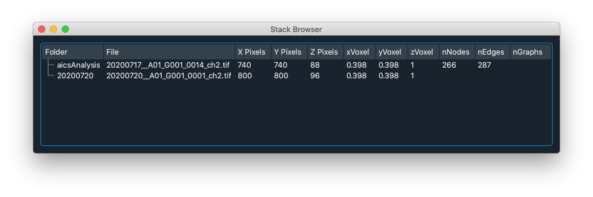
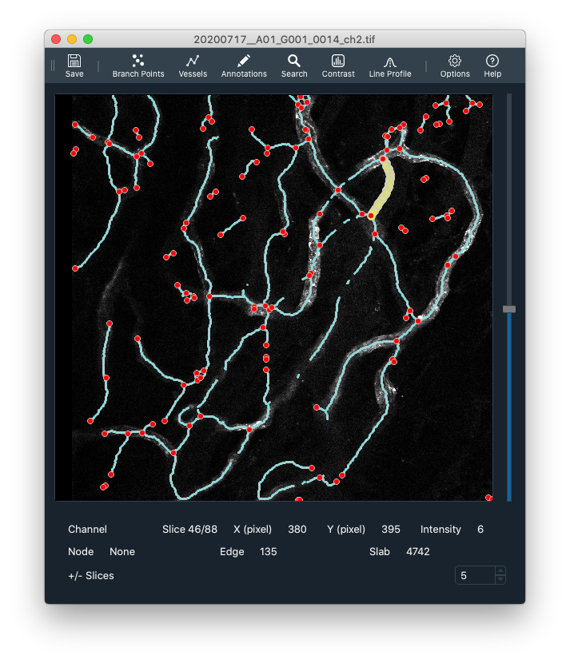

### Stack Browser

The stack browser is the main interface window to load Tiff files.

Drag and drop Tiff files into the stack browser and double-click to open a stack-window.

### Stack Window

Example 1

Example 2

### Toolbars

Each stack window has a number of toolbars.

#### Main

The main toolbar is always at the top of each stack window.

- <B>Save</B> - Save the tracing as a .h5f file
- '1' - Display channel 1
- '2' - Display channel 2
- rgb - Display multi channel tiff as RGB
- sliding-z - Display channel as a small z-projection for each slice
- Branch Points. Display a list of branch points.
- Vessels. Display a list of vessels (vessels are segments between branch points)
- Annotations. Display annotations. Annotations are added with a+click
- Tracing. toggle the tracing on and off
- '-': Decrease the tracing size
- '+': Increase the tracing size
- Set Type: Use keyboard 0,1,2,... to set selected object type (usually keyboard 1,2,3 switches channel)
- Hamburger: Dropdown menu to set toggle toolbars, set options, and display this help.

#### Status

The status toolbar is at the bottom of each stack window. It reports the current channel, image slice, cursor/mouse position, intensity, and any selected annotation objects.

#### Contrast

#### Line Profile

#### Search

### Plots

### Editing

a + Click, Add an annotation
Shift + Click, Add a branch point
e + click, Add an edge (New edge will go from selected node to clicked position or connect to another existing branch point)

left-click, Select an object
Del, delete selected object

### Keyboard

| Keyboard | Right-Click Menu | Action                      |
| -------- | ---------------- | --------------------------- |
| 1/2/3    |                  | View Image Color Channel    |
|          | rgb              | View multichannel RGB Image |
| c        | Contrast         | Toggle Image Contrast Panel |
| l        | Line Profile     | Line Profile                |
|          |                  |                             |
